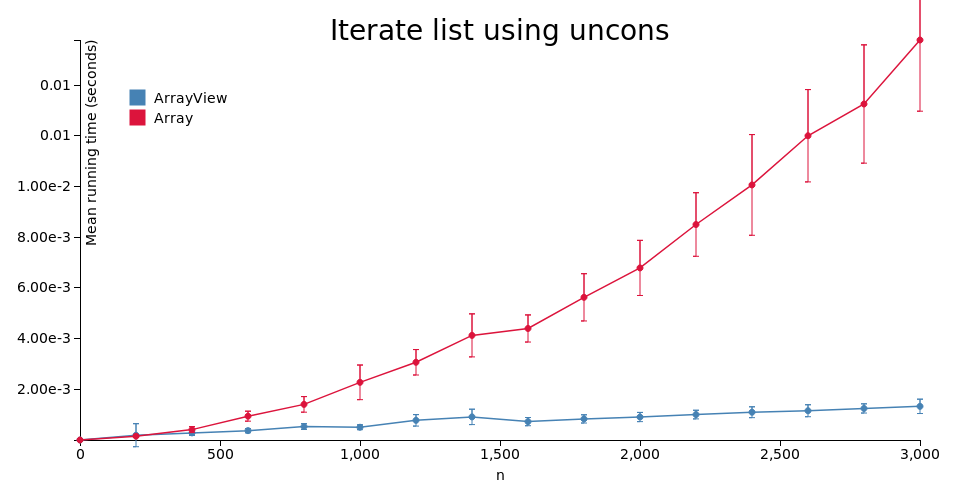

# purescript-array-views

[](https://libraries.io/github/klntsky/purescript-array-views)
[](https://travis-ci.org/klntsky/purescript-array-views)

Time complexity of `uncons` called on `Array` is *O(n)* because [`.slice()` is used](https://github.com/purescript/purescript-arrays/blob/d218f6f6fa1a41ce3bd6daeef72f9b197c1eb8d2/src/Data/Array.js#L109)  to preserve purity. Thus iterating over `Array` using `uncons` is *O(n<sup>2</sup>)*.

But since purescript `Array`s are persistent at runtime, it is possible to defer multiple `.slice()` calls by introducing another data structure and operating on it instead.

`ArrayView` contains a reference to some `Array` coupled with two numbers: index where the view starts relative to the beginning of the array and the length of the view.

```purescript
newtype ArrayView a = View { from :: Int, len :: Int, arr :: Array a }
```


So, instead of slicing, it is possible to just shift the indices.

Obviously, this technique does not improve the asymptotics of `cons`/`snoc`/`append` and other array constructing functions, so if the code uses these, there will be no benefit in replacing `Array` with `ArrayView`.

It should be noted once more that iterating over ordinary arrays using `cons` and `uncons`, which is common in Haskell (with lists) is a bad practice. Often such code can be refactored to use some type of fold and/or other standard functionals. However, there are cases where it is not straightforward, or where using `uncons`/`unsnoc` is more syntactically appealing, e.g. when iterating over many structures at once.

## Asymptotics comparison

For every function in `Data.Array` there is a corresponding function in `Data.ArrayView`, though most of them are plain reuses up to conversions between `Array` and `ArrayView`. Those with different time complexities are listed below:

| functions                                                                         | Array / NonEmptyArray | ArrayView / NonEmptyArrayView | Note                                                                   |
|-----------------------------------------------------------------------------------|-----------------------|-------------------------------|------------------------------------------------------------------------|
| `slice`, `uncons`, `unsnoc`, `tail`, `init`, `take`, `drop`, `takeEnd`, `dropEnd` | *O(n)*                | *O(1)*                        | *n* is the length of the resulting array                               |
| `span` (used by `takeWhile`, `dropWhile`)                                         | *O(n+m)*              | *O(n)*                        | *n* is the length of the `init` array, *m* is the length of the `rest` |
| `Data.ArrayView.toArray`                                                          | *-*                   | *O(n)*                        | *O(1)* if the given view corresponds to the whole array                |
| `Data.ArrayView.fromArray`                                                        | *O(1)*                | *-*                           |                                                                        |

## API

This package's API mimics the API of `purescript-arrays` up to certain extent. For most use cases, just changing the imports is enough.

This table may be useful for incorporating this library into existing codebase:

| Name                              | Replacement                               | Note                                                                                                      |
|-----------------------------------|-------------------------------------------|-----------------------------------------------------------------------------------------------------------|
| `Data.Array`                      | `Data.ArrayView`                          |                                                                                                           |
| `Data.Array.NonEmpty`             | `Data.ArrayView.NonEmpty`                 |                                                                                                           |
| `Data.Array.NonEmpty.fromArray`   | `Data.ArrayView.NonEmpty.fromArrayView`   |                                                                                                           |
| `Data.Array.NonEmpty.toArray`     | `Data.ArrayView.NonEmpty.toArrayView`     |                                                                                                           |
| `Data.Array.some`, `many`         | `Data.ArrayView.some`, `many`             | `Lazy (f (Array a))` constaint  is not changed to `Lazy (f (ArrayView a))`   because of `OrphanInstances` |
| `Data.Array.NonEmpty.appendArray` | `Data.ArrayView.NonEmpty.appendArrayView` |                                                                                                           |

## Impact on GC

Since every `ArrayView` holds a reference to some array, the latter can't be garbage-collected while the former is used. This leads to a memory consumption overhead.

If you need to free unused parts of array, use `Data.ArrayView.force :: forall a. ArrayView a -> ArrayView a` (which performs slicing and therefore is *O(n)*).

## Benchmarks



## See also

[purescript-slices](https://github.com/jacereda/purescript-slices) is another implementation of the same technique.

## Documentation

Module documentation is [published on Pursuit](http://pursuit.purescript.org/packages/purescript-array-views).
